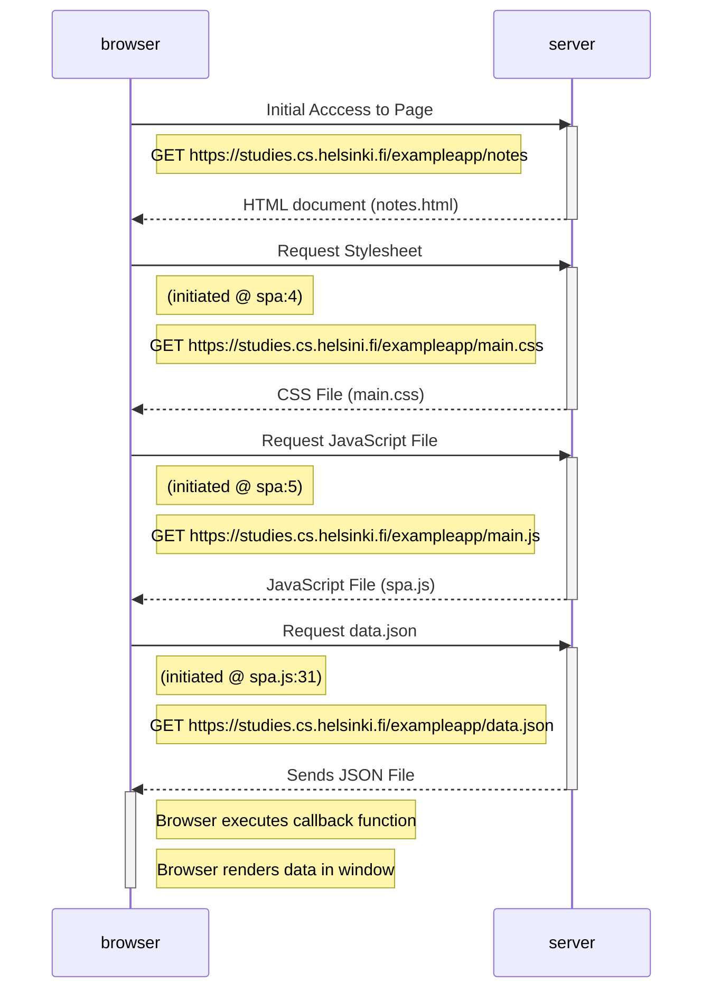

```mermaid
sequenceDiagram
    participant browser
    participant server

    browser->>server: Initial Acccess to Page
    activate server

    Note right of browser: GET https://studies.cs.helsinki.fi/exampleapp/notes

    server-->>browser: HTML document (notes.html)
    deactivate server

    browser->>server: Request Stylesheet
    activate server
    Note right of browser: (initiated @ spa:4)
    Note right of browser: GET https://studies.cs.helsini.fi/exampleapp/main.css
    server-->>browser: CSS File (main.css)
    deactivate server

    browser->>server: Request JavaScript File
    activate server
    Note right of browser: (initiated @ spa:5)
    Note right of browser: GET https://studies.cs.helsinki.fi/exampleapp/main.js
    server-->>browser: JavaScript File (spa.js)
    deactivate server

    browser->>server: Request data.json
    activate server
    Note right of browser: (initiated @ spa.js:31)
    Note right of browser: GET https://studies.cs.helsinki.fi/exampleapp/data.json
    server-->>browser: Sends JSON File
    deactivate server


    activate browser
    Note right of browser: Browser executes callback function
    Note right of browser: Browser renders data in window
    deactivate browser


```
