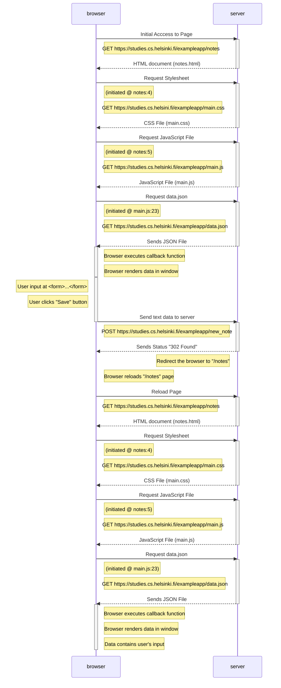

```mermaid
sequenceDiagram
    participant browser
    participant server

    browser->>server: Initial Acccess to Page
    activate server

    Note right of browser: GET https://studies.cs.helsinki.fi/exampleapp/notes

    server-->>browser: HTML document (notes.html)
    deactivate server

    browser->>server: Request Stylesheet
    activate server
    Note right of browser: (initiated @ notes:4)
    Note right of browser: GET https://studies.cs.helsini.fi/exampleapp/main.css
    server-->>browser: CSS File (main.css)
    deactivate server

    browser->>server: Request JavaScript File
    activate server
    Note right of browser: (initiated @ notes:5)
    Note right of browser: GET https://studies.cs.helsinki.fi/exampleapp/main.js
    server-->>browser: JavaScript File (main.js)
    deactivate server

    browser->>server: Request data.json
    activate server
    Note right of browser: (initiated @ main.js:23)
    Note right of browser: GET https://studies.cs.helsinki.fi/exampleapp/data.json
    server-->>browser: Sends JSON File
    deactivate server


    activate browser
    Note right of browser: Browser executes callback function
    Note right of browser: Browser renders data in window
    deactivate browser

    activate browser
    Note left of browser: User input at <form>...</form>
    Note left of browser: User clicks "Save" button

    browser->>server: Send text data to server
    deactivate browser
    activate server
    note right of browser: POST https://studies.cs.helsinki.fi/exampleapp/new_note
    server-->>browser: Sends Status "302 Found"
    deactivate server
    Note left of server: Redirect the browser to "/notes"


    Note right of browser: Browser reloads "/notes" page

    browser->>server: Reload Page
    activate server

    Note right of browser: GET https://studies.cs.helsinki.fi/exampleapp/notes

    server-->>browser: HTML document (notes.html)
    deactivate server

    browser->>server: Request Stylesheet
    activate server
    Note right of browser: (initiated @ notes:4)
    Note right of browser: GET https://studies.cs.helsini.fi/exampleapp/main.css
    server-->>browser: CSS File (main.css)
    deactivate server

    browser->>server: Request JavaScript File
    activate server
    Note right of browser: (initiated @ notes:5)
    Note right of browser: GET https://studies.cs.helsinki.fi/exampleapp/main.js
    server-->>browser: JavaScript File (main.js)
    deactivate server

    browser->>server: Request data.json
    activate server
    Note right of browser: (initiated @ main.js:23)
    Note right of browser: GET https://studies.cs.helsinki.fi/exampleapp/data.json
    server-->>browser: Sends JSON File
    deactivate server

    activate browser
    Note right of browser: Browser executes callback function
    Note right of browser: Browser renders data in window
    Note right of browser: Data contains user's input
    deactivate browser

```
