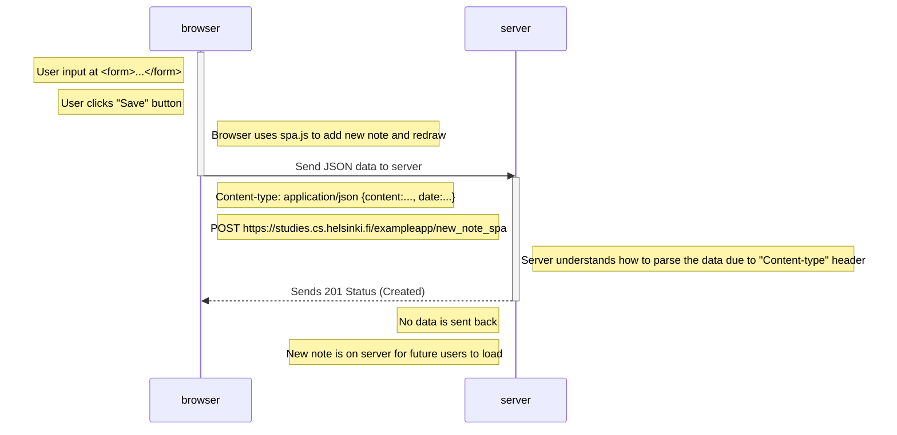

```mermaid
sequenceDiagram
    participant browser
    participant server
    activate browser
    Note left of browser: User input at <form>...</form>
    Note left of browser: User clicks "Save" button


    Note right of browser: Browser uses spa.js to add new note and redraw
    browser->>server: Send JSON data to server
    deactivate browser
    activate server
    Note right of browser: Content-type: application/json {content:..., date:...}
    Note right of browser: POST https://studies.cs.helsinki.fi/exampleapp/new_note_spa
    Note right of server: Server understands how to parse the data due to "Content-type" header
    server-->>browser: Sends 201 Status (Created)
    deactivate server
    Note left of server: No data is sent back
    Note left of server: New note is on server for future users to load
```
